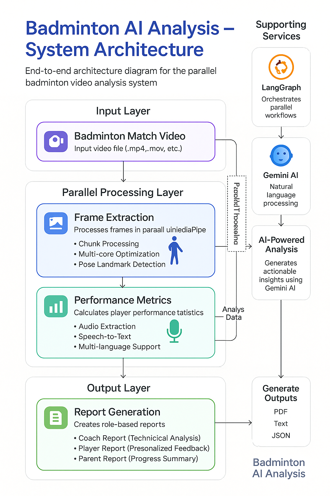

<div align="center">
  <h1>🏸 Badminton AI LangGraph Analysis</h1>
  <p>
    <a href="https://github.com/Shree2604/Badminton-AI-LangGraph-Analysis">
      
    </a>
  </p>
  <p><strong>AI-powered badminton performance analysis using computer vision, LangGraph orchestration, and Gemini AI</strong></p>
  <p>
    <a href="https://python.org">
      
    </a>
    <a href="LICENSE">
      
    </a>
    <a href="https://github.com/Shree2604/Badminton-AI-LangGraph-Analysis/pulls">
      
    </a>
  </p>
  
  <!-- YouTube Video Link with Thumbnail -->
  <a href="https://www.youtube.com/watch?v=_k7m8tg-inw">
    
  </a>
  
  <p><em>🎥 Click above to watch: Revolutionizing Badminton Training with AI: A Deep Dive into LangGraph-Powered Analysis</em></p>
</div>


## 🚀 What It Does

Transform your badminton videos into comprehensive performance insights with cutting-edge AI technology:

### 🎯 Core Features
- **🧠 Real-time pose detection** - Track 33 body keypoints with MediaPipe precision
- **⚡ LangGraph orchestration** - Seamless linear pipeline processing
- **📊 AI-generated reports** - Customized insights for coaches, players & parents
- **🌍 Multi-language support** - Available in English, Hindi, Tamil, Telugu, Kannada
- **🎥 Video annotations** - Professional pose tracking visualization
- **📈 Performance metrics** - Advanced analysis including elbow angles and wrist distances
- **📄 PDF report generation** - Professional formatting with multilingual support


## 🏗️ System Architecture

<div align="center">


*Linear pipeline architecture powered by LangGraph orchestration*
</div>

The system follows a sophisticated pipeline:
1. **Video Input** → MediaPipe pose detection
2. **Data Processing** → Performance metrics calculation
3. **AI Analysis** → Gemini-powered insights generation
4. **Report Generation** → Multi-format output (PDF, TXT, Annotated Video)


## 🛠️ Prerequisites

Before getting started, ensure you have:

| Requirement | Version | Purpose |
|-------------|---------|---------|
| **Python** | 3.8+ | Core runtime |
| **OpenCV** | Latest | Video processing |
| **MediaPipe** | Latest | Pose detection |
| **Gemini API Key** | - | AI analysis |
| **CUDA GPU** | Optional | Faster processing |


## ⚡ Quick Start

### 🔧 Installation

```bash
# 1. Clone the repository
git clone https://github.com/Shree2604/Badminton-AI-LangGraph-Analysis.git
cd Badminton-AI-LangGraph-Analysis

# 2. Create virtual environment
python -m venv venv

# 3. Activate virtual environment
# Linux/Mac:
source venv/bin/activate
# Windows:
.\venv\Scripts\activate

# 4. Install dependencies
pip install -r requirements.txt
```

### 🔑 Environment Setup

Create a `.env` file in the project root:

```env
GEMINI_API_KEY=your_gemini_api_key_here
```

### 🚀 Run Analysis

```bash
# Basic usage
python main.py --video_path your_match.mp4

# Advanced usage with all options
python main.py \
  --video_path your_match.mp4 \
  --roles coach,student,parent \
  --language en \
  --output_dir ./analysis_results
```


## 🌐 Web Application

Deploy the web interface for easy access:

```bash
# Navigate to web app
cd web_app

# Install web dependencies
pip install -r requirements.txt

# Launch Flask application
python app.py
```

🌟 **Access at:** [http://localhost:5000](http://localhost:5000)


## 🎯 Feature Overview

<div align="center">

| 🎥 **Video Processing** | 📊 **Analytics** | 📝 **Reporting** |
|:----------------------:|:----------------:|:----------------:|
| MediaPipe pose detection | Performance metrics | Role-based insights |
| Frame extraction | Elbow angle analysis | Multi-language support |
| RGB conversion | Wrist distance tracking | PDF generation |
| Pose visualization | Movement patterns | Professional formatting |


### 🔍 Detailed Capabilities

| 🎯 **Pose Analysis** | 📈 **Performance Metrics** | 🗣️ **Multi-Modal Analysis** |
|:-------------------:|:-------------------------:|:---------------------------:|
| 33-point body keypoint tracking | Joint angle calculations | Video pose detection |
| Real-time pose estimation | Distance measurements | Audio transcription (Google Web Speech API) |
| Movement pattern recognition | Movement velocity analysis | Combined insights generation |
| Biomechanical analysis | Form assessment | Speech-to-text processing |

</div>

## 🤝 Contributing

We welcome contributions! Here's how to get involved:

### 🔄 Development Workflow
1. **Fork** the repository
2. **Create** feature branch: `git checkout -b feature/amazing-feature`
3. **Commit** changes: `git commit -m 'Add amazing feature'`
4. **Push** to branch: `git push origin feature/amazing-feature`
5. **Open** a Pull Request


## 📄 License

This project is licensed under the MIT License - see the [LICENSE](LICENSE) file for details.


## 📧 Support & Contact

**Need help or have questions?**

[](mailto:shree.xai.dev@gmail.com)
[](https://github.com/Shree2604/Badminton-AI-LangGraph-Analysis/issues)

</div>

**Built with ❤️ by [ShreeRaj Mummidivarapu](https://github.com/Shree2604)**

*Elevating badminton training through artificial intelligence*

</div>
